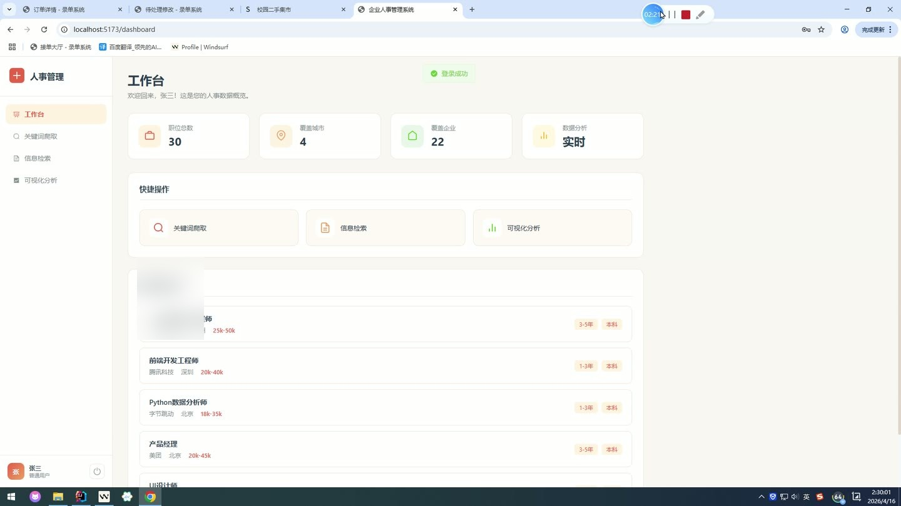
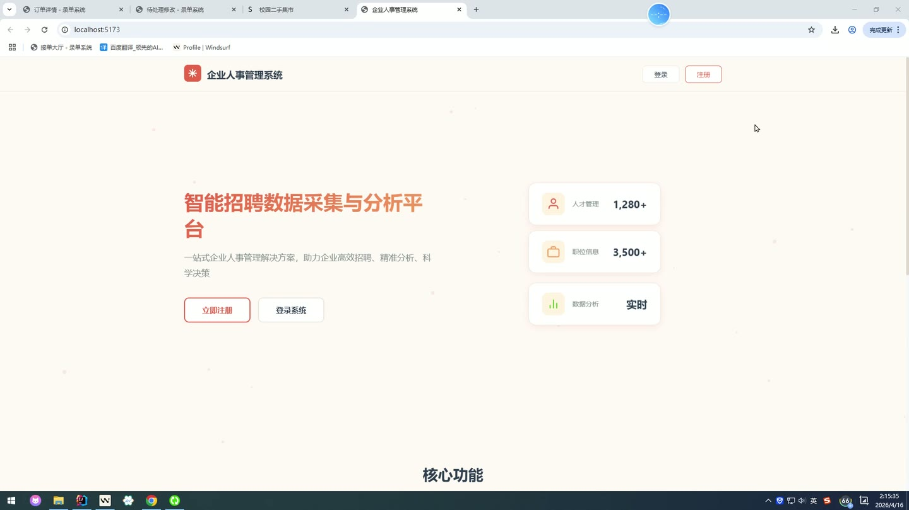

# (附文档)Springboot3+Vue3+MySQL 企业人事管理系统

**技术栈**：Springboot3、Vue3、MySQL

### 系统简介

企业人事管理系统基于 Springboot3 + Vue3 前后端分离架构，提供招聘数据智能采集、多维度职位检索、可视化统计分析以及用户权限管理功能。系统包含普通用户与管理员两种角色，支持关键词爬取招聘信息、数据看板展示、用户注册登录及后台管控。
 
### 核心功能
 
### 普通用户端

 
- 用户注册：填写用户名、密码、昵称、邮箱、手机号完成注册，系统自动分配普通用户角色并启用账号 
- 用户登录：通过用户名和密码进行身份验证，支持普通用户与管理员两种角色自动识别跳转 
- 快速登录：页面提供"普通用户登录"与"管理员登录"快捷按钮，一键填充预设账号密码并执行登录 
- 关键词爬取：输入职位关键词（如 Java、前端、产品经理），调用后端爬虫服务采集网络招聘数据，实时返回结果列表 
- 热门关键词：点击页面预设的"Java/前端/Python/产品经理/人力资源"等标签快速触发爬取 
- 职位信息检索：按职位标题、公司名称、城市等维度进行分页搜索，支持模糊匹配与按时间倒序排列 
- 职位详情查看：点击任意职位可查看完整的职位描述、薪资、经验要求、学历要求等详细信息 
- 数据统计看板：展示职位总数、覆盖城市数、覆盖企业数等核心指标，以卡片形式呈现实时数据 
- 最新职位列表：工作台页面默认展示最近 5 条职位信息，包含公司、城市、薪资等关键字段 
- 快捷导航：工作台提供"关键词爬取""信息检索""可视化分析"三个快捷入口，一键跳转对应功能页 
- 可视化分析：查看城市分布、职位类型分布、学历分布、经验分布、公司分布、关键词分布等统计图表 
- 用户信息展示：页面顶部显示当前登录用户的昵称与角色标识
 
### 管理员端

 
- 用户列表管理：分页展示所有注册用户，支持按用户名、昵称、邮箱关键词模糊搜索 
- 用户信息编辑：修改用户的昵称、邮箱、手机号、角色（普通用户/管理员）等字段 
- 用户状态切换：一键启用或禁用用户账号，禁用后用户无法登录系统并提示"账号已被禁用" 
- 用户删除：确认弹窗后删除指定用户账号及关联数据 
- 管理员专属侧边栏：左侧固定导航包含"用户管理"菜单项，底部显示当前管理员信息与退出按钮 
- 用户角色标识：表格中以标签形式显示用户角色（管理员/普通用户），并用不同颜色区分 
- 用户状态标识：表格中以标签形式显示用户状态（启用/禁用），并用绿色/红色区分 
- 分页控制：支持自定义每页显示条数，底部显示总记录数并支持页码切换
 
### 技术栈

 后端框架Spring Boot 3 ORMMyBatis-Plus 3.5 权限认证Spring Security + JWT 令牌 密码加密BCryptPasswordEncoder 前端框架Vue 3 (Composition API + setup 语法) 状态管理Pinia UI 组件库Element Plus 路由Vue Router 4 (History 模式) 构建工具Vite 数据库MySQL 8.0 HTTP 客户端Axios 数据序列化Jackson 文件上传Spring MultipartFile (最大 10MB)
 
### 交付内容

 
- 后端完整源码 
- 前端完整源码 
- 数据库初始化脚本 
- 万字文档

## 界面展示

---

## 获取完整源码 + 万字文档

本仓库为项目介绍页。**完整前后端源码、数据库初始化脚本、万字项目文档**，请加微信 `kangkangcode`，或访问 [codekk.top](http://codekk.top) 获取。

可作课程设计 / 毕业设计参考，支持远程部署调试。